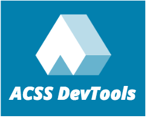

# acss-devtools

[Chrome devtool extension for Atomic css](https://chrome.google.com/webstore/detail/atomic-css-devtool/dpkcndhnanpdlppppalhnhfbokhicdmi?utm_source=gmail)

Turn your element style into Atomic css class automatically, be a happy atomizer!

## Develop

* Update version in `manifest.json`
* run `npm run build`
* Publish `acss_devtools-prod.zip` in `dest`
